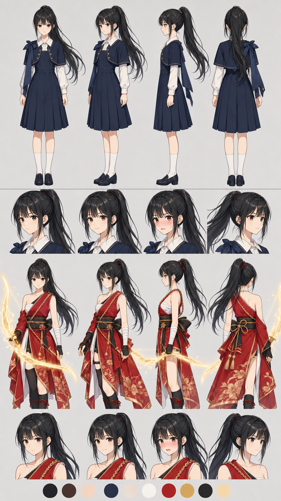

# キャラクターシート：篠宮 澪（しのみや みお）

> ヒロインの**制作用・即参照シート**（容姿/体型・服装・性格・口調・能力・関係・声/演技の参照）。
> 設計の根拠・物語機能は [heroine_core.md](heroine_core.md)（正本）。本シートはビジュアル・キャスティング・演技・短尺制作のための要約。
> 関連：主人公＝[character_sheet_nagi.md](character_sheet_nagi.md)／タトゥー＝[digital_tattoo.md](digital_tattoo.md)（弓・コスチューム §6.5）／第2話＝[../manuscript/book1/02-01_mirareteita.md](../manuscript/book1/02-01_mirareteita.md)。
> ステータス：**v0.2**（2026-06-14 §7 ビジュアルリファレンス仕様＋設定画リンクを追加）。

---

## 0. 基本

| 項目 | 内容 |
|---|---|
| 氏名 | **篠宮 澪（しのみや みお）** |
| 年齢/学年 | 16歳・ナギと同学年（山手聖二葉女学院 高等部1年） |
| 所属 | 弓道部のエース／**登録された監視者**（体制側） |
| 立ち位置 | メインヒロイン。敵でない障害→じわじわ接近する王道路線 |
| 一言 | **「洋の器に和の芯」**＝ミッション校（洋）に通い弓道（和）を体現＝ハーフ主人公の鏡像 |

---

## 1. 容姿・体型（顔・体型リファレンス）

> **顔・体型の正典リファレンス＝著者提示の写真2枚**：[../../media/common/reference/スクリーンショット 2026-06-14 201207.png](../../media/common/reference/) と [../../media/common/reference/スクリーンショット 2026-06-14 201259.png](../../media/common/reference/)（モデル＝森脇リリカ／※実在人物。顔立ち・体型・雰囲気の参照に用い、経歴等の事実は断定しない）。

| 項目 | 内容 |
|---|---|
| 髪 | **黒髪のロング**（やや柔らかなストレート〜ゆるいウェーブ）。普段は弓のため高い位置でひとつに結ぶ（ポニーテール）／下ろすと写真2のように柔らかい印象。※色は黒＝canon（リファレンス画の明色から変更） |
| 顔立ち | **丸みのある優しい輪郭**・大きめの澄んだ瞳・あどけなさと品の同居。**凛とした表情（写真1）と、ふっとほどける柔らかい笑顔（写真2）の二面**。 |
| 体型 | **小柄〜中背・細身で華奢**。だが弓道で**背筋が通り姿勢が良い**（華奢さと芯の同居）。所作が静かで丁寧。 |
| 目 | 切れ長というより**大きく落ち着いた目**。**目を離さない**（監視＝狙撃の人格表現）。素のときは目元が柔らかい。 |
| 第一印象 | 静かで品がある優等生。だが目だけが強い。話すと意外に素直で、ふと幼く笑う。 |

---

## 2. 服装

| シーン | 服装 |
|---|---|
| 表層（学校・日常） | **山手聖二葉女学院の制服**＝紺のジャンパースカート＋ボレロ（雙葉系ミッション校の品）。肩に**弓巻**を提げる。私服は写真2系（ふんわりした白ニット等・柔らかい少女らしさ）。 |
| 深層（ダンジョン） | **緋色基調の和風の射手装束**＝コスチューム（能力の外在化・[digital_tattoo §6.5](digital_tattoo.md)）。黒髪ポニーテール・たすき/片肌・光の弓。**リファレンス＝[image_yoimiya.png](../../media/common/reference/image_yoimiya.png)（和風射手の構図・黒髪版）**。制服（洋）↔装束（和）の落差＝主題の可視化。 |

---

## 3. 性格・ペルソナ

> **声・雰囲気のキャスティング参照＝森脇リリカ**（明るい親しみやすさと凛とした芯の同居／※実在人物・雰囲気の参照として用い人格は澪として設計）。

| 面 | 内容 |
|---|---|
| **表（公・職務）** | 静・礼・**有無を言わせぬ芯**。規律を重んじる優等生。穏やかだが一歩も引かない。監視者としては「見つけて・確かめて・報告する」を職務として遂行。 |
| **素（私・油断時）** | 抑えていた表情がほどけると**柔らかく素直で、笑うと急にあどけない**（写真2）。本当は同年代との距離の取り方が不器用。 |
| **ナギの前で** | その抑えが**少しずつ崩れていく**。報告すべき相手なのに、気づくと素が出てしまう。 |
| **芯** | 改変＝禁忌を**正しく信じている**（10巻受容と将来衝突）。信念に根ざした者＝根を持つ者（根を半分失ったナギの鏡像）。 |

### 3.5 ラッキースケベ的接触（コメディ・ギャップ）**[著者方針]**

- **設計の核＝距離のギャップ**：澪は**遠隔狙撃手＝間合いを支配し、近づかない子**。なのに戦闘・イレギュラー・とっさの事故で**物理的な密着が起きてしまう**＝本人の意に反した接触。**距離を支配する者が距離を奪われて取り乱す**＝強み（遠隔・冷静）の裏返しのギャップ萌え。
- **反応の型**：照れ→**過剰に取り繕う**→丁寧語が崩れる／にらむ／弓を構えかけて引っ込める。普段の凛が一瞬で崩壊するコントラスト。
- **節度**：**健全・コメディ寄り・16歳相応**。過度な性的描写はしない（事故的接触・接近・取り乱しの可笑しさで魅せる）。担当レビュー＝[editor-tsukikage](../../.claude/skills/editor-tsukikage/SKILL.md)（コメディ・テンポ）。
- **機能**：シリアス（監視・板挟み・重厚）と並走する**緩急の緩**。緊張続きの関係に呼吸を作り、距離が縮む実感を出す。

---

## 4. 口調・セリフ

| 項目 | 内容 |
|---|---|
| 一人称 | **わたし** |
| 二人称 | ナギを当初「君」（名を知らない）→ 後に名前へ |
| 基調 | **静かな丁寧語**（です・ます）。短く言い切る。感情は**間で語る**。 |
| 崩れ | 油断・照れ・動揺で**敬語がほどけて素が出る**（「……っ、見ないで」等） |
| 例 | 「君だよね。昨日、あそこに入ったの」「登録、してないでしょう」「……いい子だから。確かめてから、報告する」「今日は、見なかったことにする」 |

---

## 5. 能力（弓型タトゥー＝外付け・支給品）

| 項目 | 内容 |
|---|---|
| 形 | 光の弦の弓（金属でない＝力の象徴）。体制から**貸与された弓具**に刻まれた**外付けタトゥー**＝監視装置の末端。 |
| 核 | **遠隔で一点を撃ち抜く＝ピンポイント編集**。戻り標（帰り道のしるし）を射抜ける。 |
| 弱点 | 接近・遮蔽・速攻に弱い。**最大の弱点＝撃つべき一点が無い相手**（無数・面・座標が溶ける混沌＝第2話のイレギュラー）。一射ごとに集中。 |
| 対比 | 澪＝**点**（狙う）／ナギ＝**面**（起きた出来事に触れる）。 |

---

## 6. 関係・今後

| 相手 | 関係 |
|---|---|
| ナギ | 報告すべき監視対象→見逃す→じわじわ接近。点vs面の対照。ラッキースケベで距離が縮む緩、信念衝突（改変=禁忌）が重厚のシリアス。 |
| 体制（"上"） | 末端の監視者。弓は支給品＝取り上げられうる（将来の火種）。 |
| 剣の少年（温存） | 後巻の近接ライバル候補。 |

---

## 7. ビジュアルリファレンス仕様（動画制作用・設定画）

> **狙い**：このシートだけで `storyboard`／`seedance`（codex 生成）が**一貫した澪の画**を出せるよう、多角度・小物・色を言葉で定義する。表現規則＝武器は**光の象徴**（金属でない）・読める文字/数字/HUD なし・git 用語非表示。著者写真は載せず、読み取った特徴を文章化（§1・§3 と整合）。

### 7.1 多角度（ターンアラウンド）

| アングル | 要点 |
|---|---|
| 正面 | 黒髪ハイポニーテール／背筋が通り姿勢が良い（華奢＋芯）。目を離さない強い視線。 |
| 斜め45度 | ポニーの毛流れと弓巻のラインが見える。和の端正な横顔の入り。 |
| 真横（プロフィール） | 弓を引く所作の基本。顎を引いた残心の構え。 |
| 背面 | ポニーの結び・たすき掛け・装束の帯（深層時）が分かる。 |
| 表情差分 | ①凛（無表情・狙う）②素の柔らかい笑顔（あどけない）③照れ崩れ（敬語がほどける動揺）④集中（射の瞬間）。 |

- **二層を必ず描き分け**：表層＝制服（洋の器）／深層＝緋色の和風射手装束（和の芯）。同一人物として髪・顔・体型を一致させる。

### 7.2 小物・署名アイテム

| アイテム | 見た目 | 意味・機構 | 登場 |
|---|---|---|---|
| 弓巻（ゆまき） | 肩に提げる細長い布袋 | 弓道部のエースの署名小物 | 表層（学校） |
| 光の弓 | 金属でない**光の弦の弓**（淡い金〜白光の具現） | 外付けタトゥー＝監視装置の末端（支給品）。遠隔ピンポイント編集 | 深層（戦闘） |
| たすき／片肌 | 緋色装束の射手結び | 射の所作・和の芯の可視化 | 深層 |
| 制服のボレロ＋ジャンパースカート | 紺基調・ミッション校の品 | 表層（洋の器） | 学校・日常 |

### 7.3 カラー指定（目安）

| 部位 | 色名 | 参考コード | 備考 |
|---|---|---|---|
| 髪 | 艶のある黒（漆黒） | `#1A1A1E` | **canon＝黒**（著者写真の明色から変更）。ハイライトは寒色寄り |
| 瞳 | 落ち着いた濃茶〜黒 | `#3B2A24` | 大きく落ち着いた目。視線が強い |
| 肌 | 白い肌 | `#F5E6DC` | — |
| 表層衣装（制服） | 紺＋白 | `#1F2A44` ／ `#F2F2F0` | 紺ジャンパースカート＋白襟/ボレロ |
| コスチューム（深層） | 緋色基調＋金差し＋黒 | `#C8102E` ／ `#C8A24B` ／ `#16161A` | 和風射手装束（image_yoimiya.png は黒髪版を採用） |
| 能力光（光の弓） | 淡い金〜白光 | `#F3E2A9` | 力の象徴。金属でない |

### 7.4 プロンプト用キャラ正典ブロック（英語・コピペ用）

```text
Mio Shinomiya, a petite 16-year-old Japanese girl, kyudo (Japanese archery) ace. Glossy jet-black long hair tied in a high ponytail (soft when let down); large calm dark eyes with a steady, unwavering gaze; fair skin; slender, delicate build but upright, well-trained posture (graceful yet strong). TWO looks, same girl: (A) surface — navy Catholic-mission-school uniform (jumper skirt + bolero), a slim cloth bow-wrap over the shoulder, quiet and refined; (B) deep layer — a crimson Japanese archer costume (one shoulder bare, tasuki sash, black accents, gold trim) wielding a bow of pure pale-gold light (NOT metal — a manifestation of power). Calm, composed, polite; softens into an unexpectedly childlike smile off guard. Light modern-anime tone. No readable text, no numbers, no HUD.
```

### 7.5 リファレンス画像（codex 生成）

> 下記は §7.1–7.4 を台本に codex で生成した設定画。プレビュー確認用に埋め込む（著者写真ではなく**生成物**）。直す場合はプロンプト修正→ v+1 再生成。

**v1（2026-06-14・codex 生成）**：表層＝紺制服のターンアラウンド（正面/斜め/横/背面）＋表情差分／深層＝緋色の和風射手装束＋光の弓＋表情差分／下段に配色見本。



- 生成物：[../../media/common/characters/character-mio/outputs/ref_sheet_v1.png](../../media/common/characters/character-mio/outputs/ref_sheet_v1.png)

---

## 改訂履歴

| 日付 | 内容 |
|---|---|
| 2026-06-14 v0.1 | 著者リファレンス（顔・体型＝写真2枚＝森脇リリカ／コスチューム＝image.png／ペルソナ＝森脇リリカ参照／ラッキースケベ的接触）を反映し制作用シートを新規作成。容姿に「凛と柔らかいの二面」、性格に「表＝静/礼・素＝柔らかい・ナギの前で崩れる」、§3.5 ラッキースケベ（距離のギャップ・健全コメディ）を規格化。heroine_core を正本とし本シートは即参照用 |
| 2026-06-14 v0.2 | `character-sheet` スキルで **§7 ビジュアルリファレンス仕様**（7.1 ターンアラウンド／7.2 小物／7.3 カラー指定／7.4 英語キャラ正典ブロック）を追加。§7.5 に codex 生成の設定画 v1（制服TA＋緋色射手装束＋表情差分＋配色見本）を埋め込み（プレビュー確認用） |
