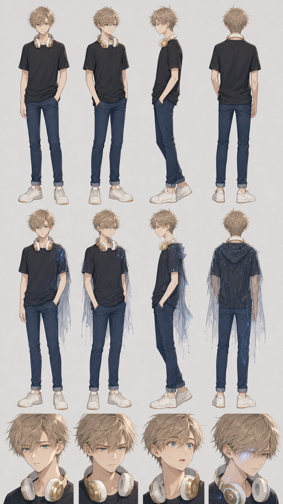

# キャラクターシート：ナギ（主人公・仮名）

> 主人公の**制作用・即参照シート**（容姿/体型・服装・性格・口調・能力・関係・声/演技の参照）。
> 設計の根拠・喪失/願いの核は [protagonist_core.md](protagonist_core.md)（正本）。本シートはビジュアル・演技・短尺制作のための要約。
> 関連：ヒロイン＝[character_sheet_mio.md](character_sheet_mio.md)／タトゥー＝[digital_tattoo.md](digital_tattoo.md)／あざ＝[anomaly_mark.md](anomaly_mark.md)／FAB＝[fab_persona.md](fab_persona.md)。
> ステータス：**v0.2**（2026-06-14 §7 ビジュアルリファレンス仕様＋設定画リンクを追加）。

---

## 0. 基本

| 項目 | 内容 |
|---|---|
| 氏名 | **ナギ（仮）**。正式名・国籍の詳細は[未決]（[protagonist_core §4](protagonist_core.md)） |
| 年齢/学年 | 16歳・聖稜学院（山手のカトリック男子ミッション校）の留学生 |
| 出自 | **日本 × 欧米系ハーフ**。失った親＝欧米側／存命の親＝日本側 |
| 住まい | 横浜・本牧の古い下宿（駅無し・海が近い・足元の深層に幻の地下鉄駅） |
| 一言 | **どちらの国でも少し浮く＝根を半分失った者**。深層の異常に惹かれて寄り道する「歩く exploit」 |

---

## 1. 容姿・体型

> 容姿リファレンス＝[../../media/common/characters/参考画像/](../../media/common/characters/参考画像)（William Franklyn-Miller 系・[protagonist_core §0.1](protagonist_core.md)）。

| 項目 | 内容 |
|---|---|
| 髪 | **アッシュ〜ダーティブロンドの無造作レイヤー**。長い流し前髪が額にかかる（あざを隠す）、サイド短め。 |
| 顔立ち | **大きく淡い瞳（青〜青緑）**、明るい肌、整った中性的な顔。物静かで少し憂い。**目元にわずかな東アジアの柔らかさ**＝「明らかにハーフ」。 |
| 体型 | **長身・細身**（同年代より頭ひとつ高い）。澪より頭ひとつ高い。 |
| あざ | 前髪の下（額）に淡く浮かぶ二重写しの薄い線。前髪で隠せる。熱を持つことがある。 |
| 第一印象 | 目立つ外来者。物静か。日本では「日本人なのに日本人に見えない」二重性。 |

---

## 2. 服装・署名アイテム

| 項目 | 内容 |
|---|---|
| 表層（日常） | カジュアル（ダーク系T・デニム等）。日常の温度。 |
| 署名アイテム | 首にかけた**白×ゴールドのオンイヤー・ヘッドホン**（海の向こうから持ってきた古い品）。**FABの接続アンカー（外付けタトゥー）＝「ヘッドホン越しの声」**の機構。実は失った親の仕込み（中盤開示）。 |
| 深層（ダンジョン） | **現状ほぼ素のまま＋ヘッドホン**（弱い・積み上げが浅い＝伸びしろ）。強くなるほど**雨motifの装束（コスチューム）**が顕れる余地（[digital_tattoo §6.5](digital_tattoo.md)・澪の和風射手装束との対比）。 |

---

## 3. 性格・ペルソナ

| 面 | 内容 |
|---|---|
| 基調 | 物静か・優しい・受け身に見えて、**いざとなると体が先に動く**（友を追って深層へ飛び込む）。 |
| 核の痛み | **喪失**（失った親）。願い＝「一回でいいから止んでほしかった」＝失った日をなかったことにしたい（＝最大の禁忌＝自己言及の罠）。 |
| 強さの質 | 狙わない。**起きてしまった出来事（面・履歴）に触れる**＝歩く exploit。混沌の継ぎ目を掴む。 |
| 弱さ | 弱い（今は倒せない・凌ぐだけ）。**削れ**＝強くなるほど新天地の温もり（味・名前）を失う不安。 |
| 砦 | **あざ＝喪った親の記憶＝最後まで削れに渡さない一点**（人間性の砦）。 |

---

## 4. 口調・セリフ

| 項目 | 内容 |
|---|---|
| 一人称 | 俺（おれ）／地の文では「ナギ」 |
| 基調 | 平易な現代口語・短文。心の中でFABに相槌（声に出すと不審がられる）。 |
| 技名 | 英語/カタカナ寄り＋雨motif：守り＝**《アンブレラ》**（見え方＝半透明のシールド）／消す＝**《サンブレイク》**。 |
| 例 | 「行かないほうがいい」「走るよ。友達がいる」「お前……機械じゃ、ないのか」 |

---

## 5. 能力（あざ＋自作タトゥー）

| 項目 | 内容 |
|---|---|
| あざ | 生まれつき・複製不可・究極の形見（自然物）。力の異常適合の源。 |
| 技 | 自作の小さな術。《アンブレラ》（守り＝半透明のシールド）／《サンブレイク》（起きたことを「なかったこと」に）。 |
| 相性 | ハーフ＝二系譜ゆえ**ねじれた相性**（定番が使えない／他人に扱えない領域に届く）＝固有性かつ孤立。 |
| 現状 | 軽い身体強化＋状況技で凌ぐ段階。おれつえーは大弧IIIで。 |

---

## 6. 関係

| 相手 | 関係 |
|---|---|
| FAB | 相棒AI（ヘッドホン越しの声）。やさしいが温度がない。削れの誘惑／7巻裏切り。 |
| 澪 | 監視してくる弓道の少女。点vs面の対照。見逃される→じわじわ接近（ラッキースケベの緩＋信念衝突の重）。 |
| 悠（ゆう） | 同級生。第1話で深層に巻き込まれ記憶を失う（何も覚えていない）。 |

---

## 7. ビジュアルリファレンス仕様（動画制作用・設定画）

> **狙い**：このシートだけで `storyboard`／`seedance`（codex 生成）が**一貫したナギの画**を出せるよう、多角度・小物・色を言葉で定義する。表現規則＝FAB は出さない／武器・能力は**光の象徴**（青い光）・読める文字/数字/HUD なし・git 用語非表示。正本＝[protagonist_core §0.1](protagonist_core.md)・正典ブロック＝[character-canon](../../.claude/skills/storyboard/references/character-canon.md) と整合。

### 7.1 多角度（ターンアラウンド）

| アングル | 要点 |
|---|---|
| 正面 | 長い流し前髪が額（あざ）にかかる。淡い瞳・中性的な顔。長身・細身。 |
| 斜め45度 | アッシュの無造作レイヤーの毛流れ。首にヘッドホン。 |
| 真横（プロフィール） | 高い背・細い首・ヘッドホンのオンイヤー形状。 |
| 背面 | レイヤーの後ろ髪・ヘッドホンのバンド。 |
| 表情差分 | ①物静か（憂い）②とっさに動く（決意）③驚き（「機械じゃ、ないのか」）④あざが熱を持つ瞬間（淡い発光）。 |

- **二層を描き分け**：表層＝カジュアル＋ヘッドホン／深層＝**現状ほぼ素のまま＋ヘッドホン**（弱い＝伸びしろ。強化時のみ雨motifの装束が淡く萌芽）。澪の華やかな射手装束との対比＝「積み上げの差」。

### 7.2 小物・署名アイテム

| アイテム | 見た目 | 意味・機構 | 登場 |
|---|---|---|---|
| ヘッドホン | **白×ゴールドのオンイヤー**（古い品） | FAB 接続アンカー（外付けタトゥー）。危機/加速時に**青い線が淡く灯る**（普段は消灯）。実は失った親の仕込み（中盤開示） | 常時 |
| あざ | 前髪の下（額）の淡い二重写しの薄い線 | 究極の形見（自然物・複製不可）。熱を持つことがある。前髪で隠せる | 随時（隠匿運用） |
| デジタルタトゥー | 腕などの青い線のモチーフ | 自作の小さな術の起動時に具現化（《アンブレラ》＝半透明シールド） | 戦闘 |

### 7.3 カラー指定（目安）

| 部位 | 色名 | 参考コード | 備考 |
|---|---|---|---|
| 髪 | アッシュ〜ダーティブロンド | `#B9A88C` | 無造作レイヤー。寒色寄りのトーン |
| 瞳 | 青〜青緑 | `#6FA8B5` | 大きく淡い。少し憂い |
| 肌 | 明るい肌 | `#F2E0D0` | 目元にわずかな東アジアの柔らかさ |
| 表層衣装 | ダーク系T＋デニム | `#2B2B30` ／ `#3A4A63` | カジュアル・日常の温度 |
| ヘッドホン | 白＋ゴールド | `#F4F4F2` ／ `#C8A24B` | 署名アイテム |
| 能力光／タトゥー | 青い光 | `#5AA9E6` | 力の象徴（金属でない）。あざは控えめ発光 |

### 7.4 プロンプト用キャラ正典ブロック（英語・コピペ用）

> 正典は [character-canon.md](../../.claude/skills/storyboard/references/character-canon.md)。`Character:` 欄にそのまま貼る。

```text
Nagi, a 16-year-old half-Japanese half-Western boy. Light ash-blond / dirty-blond layered tousled hair with long side-swept bangs falling over the forehead, shorter sides; large striking light eyes (blue to blue-green); fair skin; refined, slightly androgynous features that read as MIXED heritage — mostly Western with a subtle East-Asian softness around the eyes (clearly hapa, hard to place); tall, slim build; quiet, slightly melancholic. White-and-gold on-ear headphones resting around his neck (a faint blue line glows on them only in danger/acceleration, otherwise off); light casual modern clothes (dark tee, denim). A faint double-exposure birthmark under the bangs (subtle glow). No FAB figure, no readable text, no numbers, no HUD.
```

### 7.5 リファレンス画像（codex 生成）

> 下記は §7.1–7.4 を台本に codex で生成した設定画。プレビュー確認用に埋め込む（**生成物**）。直す場合はプロンプト修正→ v+1 再生成。

**v1（2026-06-14・codex 生成）**：表層＝カジュアル＋白金ヘッドホンのターンアラウンド（正面/斜め/横/背面）／深層＝ほぼ素＋雨motif装束の萌芽／表情差分（物静か・決意・驚き・ヘッドホンに青い線が灯る瞬間）。



- 生成物：[../../media/common/characters/character-nagi/outputs/ref_sheet_v1.png](../../media/common/characters/character-nagi/outputs/ref_sheet_v1.png)

---

## 改訂履歴

| 日付 | 内容 |
|---|---|
| 2026-06-14 v0.1 | protagonist_core を正本に、制作用の即参照シートを新規作成（容姿/体型・署名ヘッドホン・深層コスチューム（現状素）・性格/能力/口調/関係）。ヒロインシート [character_sheet_mio.md](character_sheet_mio.md) と対。 |
| 2026-06-14 v0.2 | `character-sheet` スキルで **§7 ビジュアルリファレンス仕様**（7.1 ターンアラウンド／7.2 小物／7.3 カラー指定／7.4 英語キャラ正典ブロック）を追加。§7.5 に codex 生成の設定画 v1（カジュアル＋ヘッドホンTA＋雨motif萌芽＋表情差分）を埋め込み（プレビュー確認用） |
