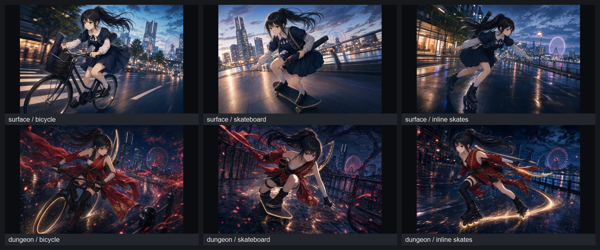

# 澪 高速移動カット検討 v1

篠宮澪が高速で街を移動する手段として、自転車／スケートボード／インラインスケートを比較するための生成カット。

狙いは「現実側の制服」と「深層側の緋色射手装束」で、それぞれ移動手段との相性を見ること。

## 比較シート

## 生成物

| No. | 状況 | 移動手段 | 画像 | 評価 |
|---|---|---|---|---|
| 01 | 表層／街 | 自転車 | [outputs/01_surface_bicycle.png](outputs/01_surface_bicycle.png) | 生活感と実用性が強い。弓巻を積めるので日常導入に向く。高速バトル感は弱め。 |
| 02 | 表層／街 | スケートボード | [outputs/02_surface_skateboard.png](outputs/02_surface_skateboard.png) | 画は強いが、澪の「静・礼・精密」と少しズレてストリート寄りになる。 |
| 03 | 表層／街 | インラインスケート | [outputs/03_surface_inline_skates.png](outputs/03_surface_inline_skates.png) | 最有力。背筋、視線、精密な滑走が澪の狙撃手性と噛み合う。 |
| 04 | 深層／ダンジョン | 自転車 | [outputs/04_dungeon_bicycle.png](outputs/04_dungeon_bicycle.png) | 疾走感はあるが、緋色装束と自転車の取り回しがやや重い。逃走・搬送用ならあり。 |
| 05 | 深層／ダンジョン | スケートボード | [outputs/05_dungeon_skateboard.png](outputs/05_dungeon_skateboard.png) | 派手で画面映えするが、澪よりアクションヒロイン色が前に出る。コメディや一回限りの借用向き。 |
| 06 | 深層／ダンジョン | インラインスケート | [outputs/06_dungeon_inline_skates.png](outputs/06_dungeon_inline_skates.png) | 最有力。足元の光跡、射手装束、弓のラインが一体化しやすい。 |

## 現時点の結論

- **本命**：インラインスケート
  - 表層では「制服のまま静かに速い」。
  - 深層では「足元の光輪／滑走軌跡」が弓の能力表現と接続しやすい。
  - 澪の現在能力である「点を取る」「距離を作る」「接近されると弱い」と相性が良い。
- **補助案**：自転車
  - 表層の日常移動、通学、弓巻の運搬には自然。
  - 深層では装束との相性が重く、戦闘カットより移動・逃走・搬送用途がよい。
- **スポット案**：スケートボード
  - 画面映えは強い。
  - ただし澪の品・弓道の静けさから少し離れるため、誰かから借りる／事故的に乗る／コメディ寄りの単発が向く。

## 次に詰めるなら

1. **インラインを正式候補化**：表層は黒い控えめなインライン、深層は車輪が淡金に発光する能力外在化。
2. **戦術に接続**：澪は近距離に詰められた時、インラインで距離を作り直して一点射撃へ戻る。
3. **衣装調整**：深層衣装は滑走時に脚さばきを邪魔しない短めの前垂れ＋長い後ろ布。露出ではなく機能美に寄せる。
4. **演出ルール**：光跡は足元だけ。敵まで伸びる射線は描かない。

## 生成メモ

- 生成日：2026-06-16
- 生成方法：Codex built-in image generation
- 参照：`media/common/characters/character-mio/outputs/ref_sheet_v3_cute_uniform.png`
- 共通禁止：読める文字、数字、HUD、ロゴ、透かし、銃、金属武器強調、ファンサービス、パンチラ、性的ポーズ。
