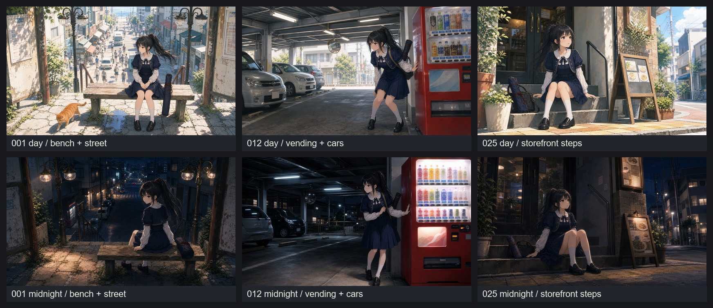

# 澪 リアル寄り生活背景フレーム再現 v1

X投稿動画の全体観察から、タッチだけでなく **カメラアングル／車／自動販売機／店先の生活感** を取り入れるための試作。

元動画のフレームそのものは複製せず、001・012・025 の構図タイプを一般化して澪に置き換えた。

## 比較シート

## 生成物

| 元フレーム | 時間帯 | 画像 | 狙い | 評価 |
|---|---|---|---|---|
| 001 | 昼 | [outputs/001_day_bench_shopping_street.png](outputs/001_day_bench_shopping_street.png) | ベンチ／階段上／商店街を見下ろす構図 | 元構図に近い。人物・街・猫の距離感がよい。 |
| 001 | 深夜 | [outputs/001_midnight_bench_shopping_street.png](outputs/001_midnight_bench_shopping_street.png) | 同じ階段上ベンチを夜景化 | 雰囲気重視。街灯と坂下の灯りで奥行きが出る。 |
| 012 | 昼 | [outputs/012_day_vending_parking.png](outputs/012_day_vending_parking.png) | 自販機／駐車場／車／鉄骨屋根 | リアル感が強い。車と自販機の生活物が画を支えている。 |
| 012 | 深夜 | [outputs/012_midnight_vending_parking.png](outputs/012_midnight_vending_parking.png) | 自販機光と駐車場の夜 | 最有力の一つ。自販機が主光源になり、澪の監視者感と合う。 |
| 025 | 昼 | [outputs/025_day_storefront_steps.png](outputs/025_day_storefront_steps.png) | 店先階段／メニューボード／植木鉢 | 生活感と可愛さのバランスがよい。表層の澪向き。 |
| 025 | 深夜 | [outputs/025_midnight_storefront_steps.png](outputs/025_midnight_storefront_steps.png) | 閉店後の店先／夜の路地 | かなり良い。夜の静けさと「待つ」画に向く。 |

## 現時点の所感

- **リアル感を取り入れるなら 012 が強い**。車、自販機、屋根梁、照明、床反射があり、背景がただの雰囲気で終わらない。
- **澪の表層ヒロイン感なら 025 昼**。店先の階段、メニューボード、植木鉢が日常の柔らかさを出す。
- **夜の物語感なら 025 深夜 or 012 深夜**。前者は静かな待機、後者は監視・追跡・違和感の発見に向く。
- **001 は「街を見下ろす導入カット」向き**。広い街の奥行きが出るので、章頭・回想・追跡前の一拍に合う。

## 次にプロンプトへ反映するルール

- 生活物は最低2つ入れる：車、自販機、メニューボード、植木鉢、駐輪場、街灯、電線、店のガラス戸。
- ただし文字・ロゴは読ませない。
- 昼は「白い壁＋黄緑＋青灰影」、夜は「青黒影＋生活光源（自販機・街灯・店内灯）」で作る。
- 澪は背景より少しシャープにし、背景は柔らかいが物の構造は読める程度にする。
