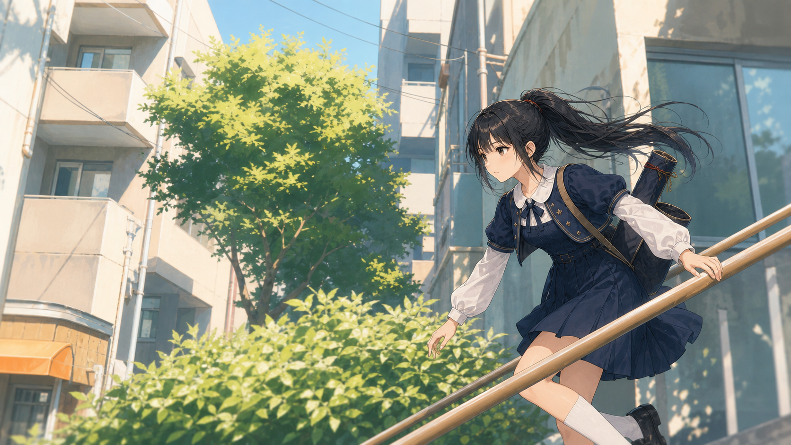

# 澪 夏の住宅街質感テスト v1

X投稿動画の11秒地点を背景質感の参考として、澪を同系統の明るい夏アニメ背景に置いた試作。

## 生成物

- 画像：`outputs/mio_summer_residential_slope_texture_test_v1.png`
- 参照解析：`tmp/x-post-fetch/2066854049555845173/frame_11s_screen_analysis.json`
- プロンプト根本ルール：[rendering_prompt_rules.md](rendering_prompt_rules.md)

## 狙い

- 動画キャプの圧縮感やブレをそのまま写さず、静止画として見られる解像感へ調整。
- 背景は柔らかく、水彩的な夏の光・葉・クリーム色の住宅壁を維持。
- 澪の顔、黒髪、制服、弓巻はキャラ資料として読める程度にシャープにする。

## 評価メモ

- 背景の方向性：良い。斜め手すり、中央の樹木、住宅街の白い壁、強い夏光が出ている。
- 澪の方向性：良い。制服と顔は読みやすい。表層衣装の質感テストとして使える。
- 元動画との差：元動画より線が締まり、静止画向き。動画キャプ風のぼけ・圧縮ノイズはかなり抑えた。
- 次に直すなら：より水彩寄りにする場合、背景建物の線をさらに溶かし、葉を面でまとめる。より動画背景寄りにする場合、前景の葉と手すりだけ少し横流れブラーを足す。
